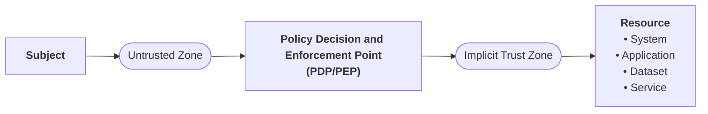

# Notas de pesquisa

## O que é Zero Trust Architecture

### Fonte 1: YouTube Video
[What Is Zero Trust Architecture (ZTA) ? NIST 800-207 Explained](https://www.youtube.com/watch?v=5Kq64vOgE10)

#### The basics
Zero trust principles:
- Never trust, always verify.
- After trust; constantly re-assess.
- No concept of internal or external users.

Tenants
1. All data sources and computing services are considered resources.
2. All communication is secured regardless of network location.
3. Access to individual enterprise resources is granted on a per session basis.
4. Every access request is evaluated by a dynamic policy. This dynamic policy should consider identity and authentication as well as device security posture and other contextual factors.
5. Authentication and authorization is strictly enforced before the subject is given access to a resource.
6. Enterprise monitors and measures the integrity and security posture of all owned and associated assets.
7. Loggin and continuous reassessment of the current state of assets, network infrastructure, and communication

### Fonte 2: Revisão sistemática
- Contexto: ZTA surge como resposta às limitações do Primeter-Based Security Model (PBSM) face ao aumento do teletrabalho e da adoção da cloud.
- Dominios de Aplicação: A arquitetura ZTA é amplamente aplicada em setores criticos, incluin cuidados de saúde, redes 5G/6G, Internet das Coisas (IoT) e ambientes de metaverso.
- Desafios: A implementação enfrenta barreiras significativas como o aumento da latência de rede, dificuldades de integração com sistemas legados e a complexidade na gestão de políticas.

### Fonte 3: Survey sobre desafios e tendências
- Pilares Técnicos: A arquitetura foca-se em três pilares centrais: autenticação de identidade (para utilizadores e dispositivos), controlo de acesso (como RBAC, ABAC e ABE) e avaliação de confiança.

- Avaliação Contínua: Os algoritmos de avaliação de confiança utilizam métodos matemáticos avançados, tais como machine learning e lógica difusa, para recalcular o risco dinamicamente.

### Fonte 4
Title: Theory and Application of Zero Trust Security: A Brief Survey
Authors:
  - Liu, Gang
  - Wang, Quan
  - Meng, Lei
  - Liu, Ling
Date: 12/2023

#### Abstract
> [!quote]
> Zero trust is a novel paradigm for cybersecurity based on the core concept of "never trust, always verify"

#### Section 1: Introduction
>[!quote]
> Traditional network security is based on the concept of a security perimeter whereby the network is divided into two parts: an internal trusted network and an external untrusted network. Based on this partition criterion, a well-structured defensive architecture treats the security of the network as an onion, and each perimeter protects the area it covers

>[!quote]
> The concept of zero trust, "never trust, always verify" was first proposed by John Kindervag in 2010 to address the issues caused by insider threats to enterprise

The three principles Kindervag proposed for zero trust security are:
1. All sources must be verified and secured;
2. Access control must be limited and strictly controlled;
3. All network traffic must be inspected and logged.

The application of zero trust has been developed in parallel with the study of its theory. We have the example of Google that proposed a new zero-trust-based security method for its internal networks that eliminates privileged corporate networks. In the proposed method, all access to enterprise resources must be fully authenticated, authorized, and encrypted based upon the device state and user credentials. By 2017, the method became fully implemented in the Google office network. It proved to be secure and made critical resources easily accessible when remote work became the norm during the COVID-19 outbreak. As zero trust gains wide attention, zero trust security is receiving greater scholarly attention, as more scholars attempt to address network security issues using abstract methods and architectures. 

The National Institute of Standards and Technology (NIST) integrated the research on zero trust and proposed the zero trust architecture (ZTA) as a basic security paradigm 

#### Section 2: Conceptual background
Definition of trust by Rousseau et al.: A psychological state comprising the intention to accept vulnerability based upon positive expectations of the intentions or behavior of another.

Even though this is a generally accepted definition of trust it does not fully capture the dynamics of the concept trust and its implications in cybersecurity. The classification os trust has always been determined by the context. With complexity and ambiguity, trust is classified based on the context. 

# Notas sobre o relatório

## Estrutura

### Introdução 
- Contexto e Motivação: A arquitetura ZTA surge como uma resposta necessária às limitações do Modelo de Segurança Baseado no Perímetro (PBSM).

- Catalisadores: Esta evolução foi impulsionada de forma significativa pelo aumento do teletrabalho e pela adoção generalizada da cloud.

- Princípio Fundamental: A premissa básica do ZTA baseia-se na regra de "nunca confiar, verificar sempre". Na sua conceção, deixa de existir qualquer distinção ou conceito de utilizadores "internos" versus "externos".

### Fundamentos e Princípios Base (NIST 800-207)
- Conceito de Recurso e Comunicação: Todas as fontes de dados e serviços de computação são categorizados como recursos, devendo toda a comunicação ser protegida independentemente da sua localização na rede.

- Fluxo de Decisão (Arquitetura Lógica): Um Sujeito (numa zona não confiável) tenta aceder ao Recurso através de um Ponto de Decisão e Aplicação de Políticas (PDP/PEP). Apenas após esta validação o sujeito entra na "Zona de Confiança Implícita".

- Gestão de Acessos e Políticas Dinâmicas:
  - O acesso aos recursos empresariais é concedido estritamente numa base "por sessão".

  - Os pedidos de acesso são avaliados mediante políticas dinâmicas que têm em conta a identidade, a autenticação, a postura de segurança do dispositivo e outros fatores de contexto.

  - A autenticação e autorização são aplicadas de forma estrita antes de qualquer acesso ao recurso ser concedido.

### Pilares técnicos e avaliação contínua de confiança
- Os Três Pilares: Tecnicamente, a ZTA assenta em três pilares centrais: autenticação de identidade (abrangendo utilizadores e dispositivos), controlo de acesso (utilizando modelos como RBAC, ABAC e ABE) e avaliação de confiança.

- Reavaliação Constante: A confiança nunca é definitiva; após o estabelecimento inicial, a confiança é constantemente reavaliada.

- Monitorização: As empresas devem monitorizar e medir continuamente a postura de segurança e a integridade de todos os ativos associados, garantindo o registo (logging) e a reavaliação do estado das comunicações e infraestruturas.

- Mecanismos Matemáticos: A avaliação de confiança recorre a algoritmos avançados, como machine learning e lógica difusa, para recalcular dinamicamente os níveis de risco.

### Domínios de aplicação 
- A aplicação do modelo ZTA é particularmente relevante em setores críticos e tecnologias emergentes, tais como:
  - Sistemas de cuidados de saúde.

  - Infraestruturas de redes 5G/6G.

  - Ecossistemas de Internet das Coisas (IoT).

  - Ambientes de Metaverso.

### Desafios de implementação 
- Apesar das suas vantagens claras, a adoção do ZTA depara-se com barreiras consideráveis:
  - O aumento da latência na rede derivado dos processos de verificação contínua.

  - A dificuldade em integrar estes novos paradigmas com sistemas legados.

  - A elevada complexidade associada à gestão de políticas de acesso tão dinâmicas e granulares.
